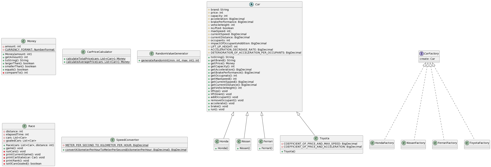
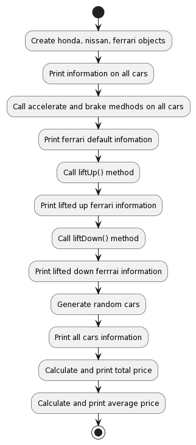

# Q4の回答と解説

Q3までの内容を前提として、以下のようなステップで課題を解いています。

- 乗員数の概念がでてきたので、乗員数を保持できるようにするために`Car`クラスに`occupants`フィールドと、`addOccupant`,`removeOccupant`メソッドを追加して乗員数の管理とその副作用を実装する
  - 明示されていないが、1人乗るごとに5%落ちる、なので、0人→100%の性能、1人→95%の性能、2人→90%、3人→85%、というようなロジックとする
  - この仕様ではインスタンス生成時の加速性能を残すか、1人増えるごとに具体的にどのくらい性能値が落ちるかを保持しなくてはならないが、デフォルト実装を活用したいので後者とする
- `Nissan`は思っていた性能がでない、ということなので、`getAcceleration`を呼び出したときに現在の`acceleration`の値の60%の値を返すように実装する
- 浮動小数点数による誤差が発生するので、`double`型から`BigDecimal`型に変えることにする
- Q3までの出力はもう必要ないので削除する

以上のステップで、クラス図、アクティビティ図は以下のとおりになっています。

## クラス図

## アクティビティ図

