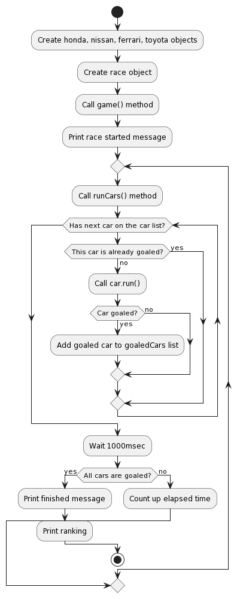

# Q1の回答と解説

ここまでは、以下のようなステップで課題を解いています。

- `Car`という基本となる抽象クラスを定義して、与えられた3種類の自動車を表す`Honda`, `Nissan`, `Ferrari`というクラスを作成
- `Honda`, `Nissan`, `Ferrari`の各クラスには`Car`クラスを継承させる
- `Car`クラスに必要なプロパティとして、ブランド、定員、価格、加速性能を定義。また、すべての自動車がアクセルとブレーキを持つため、アクセル、ブレーキメソッドを用意
  - アクセルオブジェクト等を用意してなにが起こるのかを表現してもいいかもしれないが、Q1の段階ではアクセルを踏んでどうのこうのはないので、アクセルが踏まれた、ブレーキが踏まれた、ということだけを出力する関数としておく
- コンソールに結果を出力したいので、`Car`クラスの`toString()`メソッドをオーバーライドして、いい感じに出力するようにする
- 具象クラス間の金額の関係や定員数の関係は現状生成されるインスタンスがどの具象クラスのインスタンスかによって決定されるため、これをテストするテストコードを作成
  - 現実には本田より定員が多い日産の車はあるだろうが、今回の仕様では必ず本田は日産より定員が多いのでそれを表すテストコードを記述している
- 金額の出力がよろしくないので、ValueObjectパターンを使用して、Moneyクラスを実装して金額の出力をフォーマットするように修正

以上のステップで、クラス図、アクティビティ図は以下のとおりになっています。

## クラス図

## アクティビティ図

