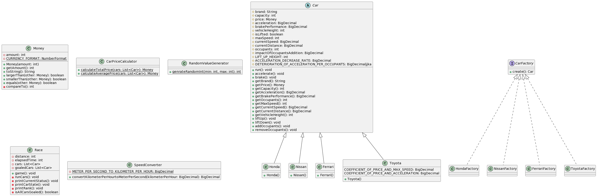

# Q2の回答と解説

Q1までの内容を前提として、以下のようなステップで課題を解いています。

- `Ferrari`だけは車高をリフトアップ、リフトダウンできるので、それらメソッドを追加するとともに、車高プロパティを追加することができるようにする
  - `Car`クラスでインスタンスを生成すると、そのままでは直接リフトアップ、リフトダウンができないので、新たに`SuperCar`クラスを定義して、`Ferrari`に継承させる
  - `SuperCar`として生成した`Ferrari`インスタンスはリフトアップ、リフトダウンができる
- リフトアップは1度だけしかできず、リフトダウンはリフトアップされた状態でないとできないという仕様から、車高をリフトアップ済みかどうかのプロパティを追加する
- リフトアップ時には加速が20%低下、およびリフトダウン時にはそれが元に戻るという副作用を実装する
- 実行時に`Ferrari`については車高も表示するようにする

以上のステップで、クラス図、アクティビティ図は以下のとおりになっています。

## クラス図

## アクティビティ図

